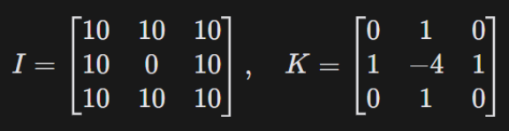
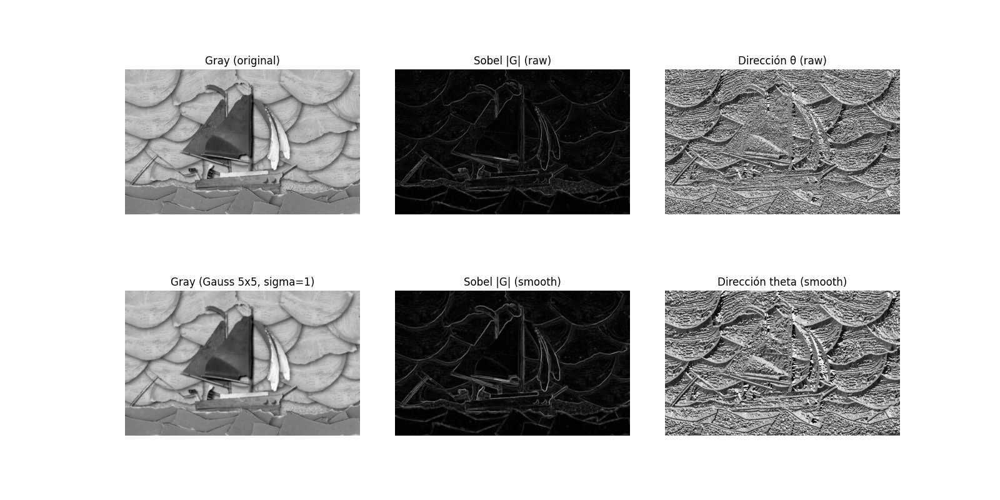
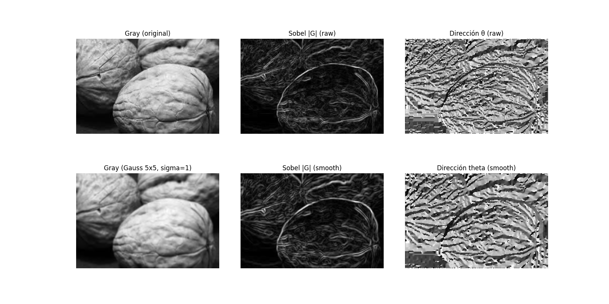
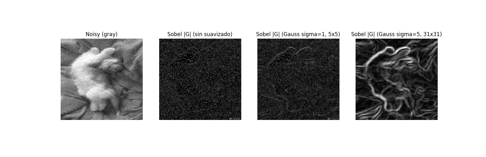
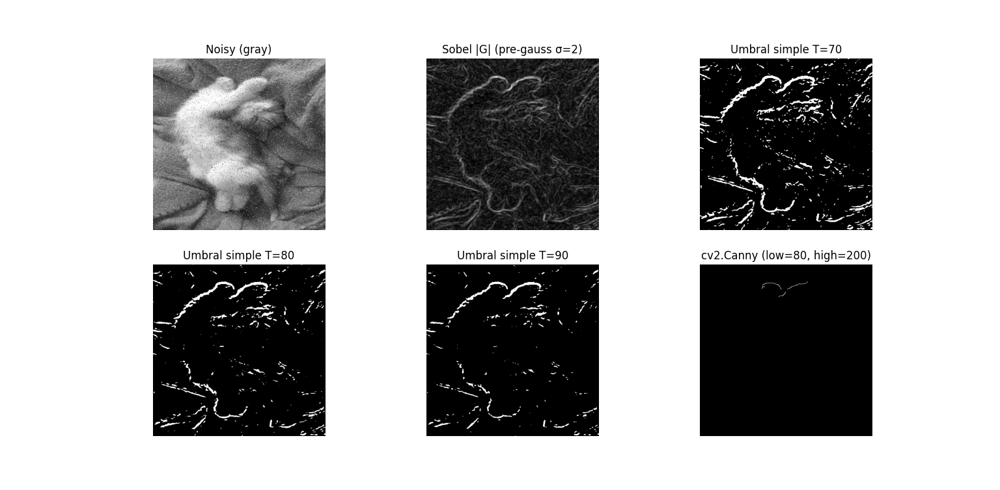

<!-- pandoc --from=markdown+implicit_figures+link_attributes labs/lab1/docs/lab1.md -o labs/lab1/docs/lab1.pdf --pdf-engine=xelatex -V geometry:top=0.67in -V geometry:bottom=0.67in -V geometry:left=0.85in -V geometry:right=0.85in -H header.tex --resource-path=.:images:labs/lab1/images/ -->
# Laboratorio 1

> **Nota:** El pdf se encuentra en [docs/](./docs/lab1.pdf)

## Enlaces

- [Repositorio](https://github.com/JosueSay/intro-to-computer-vision/tree/main/labs/lab1)

## Comandos

```bash
cd .\labs\lab1\
pip install -r requirements.txt
python ./task2.py
python ./task3.py
```

## Integrantes

| Name              | Institution ID | GitHub User |
| ----------------- | -------------- | ----------- |
| Josué Say         | 22801          | JosueSay    |
| Carlos Valladares | 221164         | vgcarlol    |

## Enlaces

- [Repositorio](https://github.com/JosueSay/intro-to-computer-vision/tree/main/worksheets/ws1)

## Task 1 - Análisis Teórico

Considerando el escenario previamente planteado, conteste:

### Pregunta 1

Su jefe sugiere usar un filtro de media (Box Filter) de 7x7 para eliminar el ruido rápido. Usted cree que es una mala idea. Explique matemáticamente y con un diagrama visual (dibujado) por qué un Box Filter de ese tamaño es perjudicial para la detección precisa de la posición de un obstáculo comparado con un filtro Gaussiano del mismo tamaño.

**Idea:** Un Box Filter 7×7 promedia todos los píxeles por igual, lo que termina desplazando y degradando la ubicación real de un borde. El filtro Gaussiano 7×7 también suaviza el ruido, pero asigna mayor peso a los píxeles cercanos al centro, conservando mejor la posición del obstáculo.

**Box Filter (media) 7×7:**

- Cada elemento del kernel tiene el mismo peso:
  
  peso = 1 / 49

- El valor de salida de un píxel se calcula como el promedio de todos los valores dentro de la ventana 7×7:

  I_salida(x, y) = (1/49) * suma de I(x+u, y+v)  
  donde u y v van de -3 a 3

- Problema para detección de obstáculos:
  - El borde se mezcla con píxeles de ambos lados con el mismo peso.
  - El contraste del borde disminuye (el borde se ve más “gris”).
  - La transición se ensancha.
  - La posición exacta del borde puede desplazarse porque influyen muchos píxeles lejanos.

**Filtro Gaussiano 7×7:**

- El peso de cada píxel depende de su distancia al centro:

  h(i,j) = (1 / (2 *pi* sigma²)) *exp( - (i² + j²) / (2* sigma²) )

- Luego el kernel se normaliza para que la suma total sea 1.

- Diferencia clave:
  - Los píxeles centrales pesan más.
  - Los píxeles lejanos pesan menos.
  - Se reduce el ruido sin destruir tanto la pendiente del borde.

**Por qué el Box 7×7 es peor para localizar obstáculos:**

En detección de bordes (Sobel, Laplaciano, Canny) se buscan cambios locales fuertes.  
Un Box Filter grande promedia demasiado, haciendo que:

- Los bordes sean más débiles.
- Algunos bordes no superen el umbral.
- La textura del suelo se mezcle con obstáculos, causando detecciones imprecisas.

**Diagrama visual (dibujado a mano):**

Se puede dibujar una señal 1D tipo escalón:

- Original: cambio brusco.
- Box 7×7: rampa ancha y desplazada.
- Gaussiano 7×7: rampa más suave pero centrada.

#### Pregunta 2

Al realizar la convolución en los bordes de la imagen (por ejemplo, en el píxel (0,0), el kernel "se sale" de la imagen).

   a. Si el robot navega por pasillos oscuros con luces brillantes al final, ¿por qué el Zero-Padding podría generar falsos positivos de bordes en la periferia de la imagen?

   b. ¿Qué estrategia de padding (Reflect, Replicate, Wrap) recomendaría para evitar esto y por qué?

Al realizar la convolución en los bordes de la imagen (por ejemplo en el píxel (0,0)), parte del kernel queda fuera de la imagen.

#### a. ¿Por qué Zero-Padding genera falsos positivos?

Con Zero-Padding, los píxeles fuera de la imagen se asumen con valor 0.  
En un pasillo oscuro con zonas brillantes, esto crea un contraste artificial entre:

- píxeles reales  
- píxeles con valor 0

Al aplicar operadores de borde, este salto artificial genera gradientes fuertes que **no existen realmente**, produciendo falsos bordes en la periferia de la imagen.

#### b. Estrategia de padding recomendada

Se recomienda **Reflect Padding**.

**Razones:**

- Refleja los valores reales de la imagen.
- Mantiene continuidad de intensidades.
- Evita saltos bruscos artificiales.
- Reduce detecciones falsas cerca de los bordes.

Comparación rápida:

- Replicate: repite el borde (aceptable).
- Wrap: mezcla lados opuestos (no realista).
- Reflect: más estable para visión robótica.

### Pregunta 3

Dada la siguiente sub-imagen I de 3x3 y el kernel K:

   a. Calcule el valor del píxel central resultante de la convolución

   Se multiplican los valores correspondientes y se suman:

   0·10 + 1·10 + 0·10  

- 1·10 + (-4)·0 + 1·10  
- 0·10 + 1·10 + 0·10  

   = 10 + 10 + 10 + 10  
   = **40**

   **Resultado:** 40

   > Nota: El kernel es simétrico, por lo que el flip de la convolución no cambia el resultado.

   b. ¿Qué tipo de estructura detecta este filtro K (conocido como Laplaciano)?

   Este kernel es un **Laplaciano 4-conexo**, un operador de segunda derivada.

   Detecta:

- Bordes
- Esquinas
- Cambios bruscos de intensidad
- Puntos aislados

   En este caso, el centro es muy distinto a sus vecinos, por lo que el filtro responde con un valor alto, indicando una discontinuidad fuerte.



## Task 2 – Práctica

Se permite el uso de OpenCV únicamente para lectura y/o escritura de imágenes y visualización de las mismas, no para algoritmos de procesamiento. Es decir, está prohibido usar `cv2.filter2D`, `cv2.GaussianBlur`, `cv2.Sobel`, o `cv2.Canny`. Debe usar NumPy y operaciones matriciales.

> **Nota:** La dirección del gradiente $\theta$ se calcula y se retorna en **radianes**, utilizando la función $\arctan2(G_y, G_x)$.

### Ejercicio 1: Convolución 2D Genérica

Escriba una función `mi_convolucion(imagen, kernel, padding_type='reflect')`, considerando lo siguiente:

- **Restricción 1:** La función debe manejar imágenes en escala de grises.
- **Restricción 2:** Debe implementar el padding manualmente antes de operar.
- **Reto de optimización:** Intente no usar 4 bucles for anidados. Investigue cómo usar slicing de NumPy o `np.einsum` para hacerlo vectorizado, o al menos reduzca a 2 bucles.
- **Nota:** Recuerde que matemáticamente la convolución invierte el kernel. Implemente el *flip* del kernel dentro de la función.

#### Qué se hizo

Se implementó la convolución 2D como operación base, tomando la idea central de clase: un **kernel** (matriz pequeña) se "barre" sobre la imagen (matriz grande) y en cada posición se calcula un **producto punto** entre vecindad y kernel para producir un nuevo píxel. Esto corresponde a la "multiplicación programada" descrita en la intuición de convolución: se aplica un "programa" (kernel) localmente para obtener una salida más útil que el valor de un solo píxel.  

**Referencia:** [BetterExplained (intuición + por qué hay flip)](https://betterexplained.com/articles/intuitive-convolution/).

#### Convolución vs correlación (flip obligatorio)

Se aplicó el *flip* del kernel internamente para cumplir la definición de convolución (a diferencia de correlación). Se asumió que algunos kernels pueden ser simétricos (p.ej. gaussiano), pero se mantuvo el flip para ser correctos en general.  

**Referencia:** [BetterExplained](https://betterexplained.com/articles/intuitive-convolution/).

#### Manejo estricto de escala de grises

Se trabajó estrictamente con imágenes 2D ($H \times W$). Si una imagen venía en BGR, se convirtió a gris antes de cualquier operación, manteniendo el contrato "grayscale".

#### Padding manual

Se implementó padding manual porque en los bordes el kernel "se sale". Se priorizó `reflect` como opción por defecto, porque minimiza discontinuidades y evita introducir bordes artificiales (como con ceros), alineado con lo discutido en clase.  
La necesidad de padding también aparece al explicar cómo se mantiene tamaño y cómo afectan bordes.  

**Referencia:** [Medium (CNN convolution)](https://medium.com/analytics-vidhya/convolution-operations-in-cnn-deep-learning-compter-vision-128906ece7d3) para la motivación de padding y borde/tamaño.  

#### Optimización (sin 4 bucles)

Se evitó el enfoque de 4 bucles anidados. La estrategia fue reducir la operación a *crear una vista por ventanas (vecindades) con slicing/estriding, y hacer la suma de productos con una operación vectorizada*.

Para el cómputo vectorizado se contempló `np.einsum` como herramienta directa para expresar la suma de productos entre ventanas y kernel.s

**Referencia:** Documentación de [`einsum`](https://numpy.org/doc/stable/reference/generated/numpy.einsum.html).  

### Ejercicio 2: Generador de Gaussianos

Escriba una función `generar_gaussiano(tamano, sigma)`. Para ello considere:

- La función debe devolver una matriz cuadrada de tamaño $tamano \times tamano$ con los coeficientes de una distribución Gaussiana 2D centrada.
- **Importante:** Asegúrese de que la suma de todos los elementos de la matriz sea igual a $1.0$ (Normalización).

#### Qué se hizo

Se generó un kernel gaussiano 2D centrado, porque en clase se justificó que el **Box Filter** introduce desenfoque "duro" y puede degradar la localización de estructuras, mientras que el Gaussiano realiza un suavizado más natural: asigna más peso al centro y decae con la distancia, preservando mejor bordes relevantes.

Se construyó una grilla centrada (coordenadas alrededor de 0) y se evaluó la Gaussiana 2D con pesos decrecientes según la distancia al centro.

#### Normalización (suma = 1.0)

Se normalizó el kernel para asegurar que la suma total fuese exactamente $1.0$. Esto mantiene el nivel promedio de intensidad y evita cambios globales de brillo al filtrar.

Referencia (concepto y motivación de blur gaussiano y rol de $\sigma$):  

- <https://himani-gulati.medium.com/understanding-the-gaussian-filter-c2cb4fb4f16b>  

- <https://www.educative.io/answers/what-is-gaussian-blur-in-image-processing>

#### Rol de $\sigma$

Se trató $\sigma$ como el control del nivel de suavizado: valores mayores suavizan más (reducen detalle fino) y valores menores suavizan menos, coherente con el preprocesamiento típico antes de derivadas/gradientes para reducir falsos bordes por ruido.

### Ejercicio 3: Pipeline de Detección de Bordes (Sobel)

Cree una función `detectar_bordes_sobel(imagen)`. Para ello considere:

- Aplique los kernels de Sobel $G_x$ y $G_y$ usando su función `mi_convolucion`.
- Calcule y retorne dos matrices:
  - **Magnitud del gradiente:**  
    $$
    G = \sqrt{G_x^2 + G_y^2}
    $$
    (Normalizada a 0–255 para visualizar)
  - **Dirección del gradiente:**  
    $$
    \theta = \arctan2(G_y, G_x)
    $$
    (En radianes o grados)

#### Qué se hizo

Se implementó el pipeline de Sobel como se discutió en clase: un borde se modela como un **cambio de intensidad** (derivada). Como las imágenes son discretas, se aproximó la derivada mediante **diferencias finitas** usando kernels Sobel.

Se definieron los kernels $G_x$ y $G_y$ y se aplicaron usando **nuestra propia** `mi_convolucion`, cumpliendo la restricción de no usar Sobel de OpenCV.

#### Magnitud del gradiente

Se calculó la magnitud:
$$
G = \sqrt{G_x^2 + G_y^2}
$$
y se normalizó a 0–255 para visualización. Esto coincide con el objetivo de producir un mapa de bordes interpretable.

#### Dirección del gradiente

Se calculó la dirección:
$$
\theta = \arctan2(G_y, G_x)
$$

usando `np.arctan2`, que elige el cuadrante correctamente (ángulo en $[-\pi, \pi]$).  

**Referencia:** documentación oficial de [`arctan2`](https://numpy.org/doc/stable/reference/generated/numpy.arctan2.html).  

### Resultados

Al aplicar Sobel directamente sobre la imagen original (**raw**), la magnitud del gradiente muestra una gran cantidad de bordes finos. Esto ocurre porque Sobel responde a **cualquier variación local de intensidad**, incluyendo textura y ruido. Como resultado, el mapa de bordes es más cargado y menos selectivo.

Al introducir un **suavizado Gaussiano previo** ($\sigma = 1$, kernel 5×5), el comportamiento cambia de forma clara. La imagen suavizada elimina variaciones pequeñas, y el Sobel aplicado posteriormente produce un mapa de bordes **más limpio y legible**, donde se resaltan principalmente las estructuras importantes.

En la **dirección del gradiente**, el caso *raw* presenta orientaciones muy variables y poco estables debido al ruido. En cambio, con suavizado, la dirección $\theta$ se vuelve **más coherente**, disminuye la cantidad de direcciones irrelevantes y los bordes aparecen mejor definidos y continuos.

> Esto confirma que aplicar un Gaussiano antes de Sobel mejora la calidad del gradiente y prepara mejor la imagen para etapas posteriores de detección de bordes.





## Task 3 – Evaluación de Ingenería y Criterio

En esta parte se evaluará la aplicación de sus algoritmos en situaciones reales. Use imágenes propias o descargue un dataset de “suelos de almacén” o “carreteras con textura”.

### Experimento A: El efecto de Sigma ($\sigma$)

Cargue una imagen con ruido (agregue ruido "Sal y Pimienta" o Gaussiano artificialmente a una foto limpia si es necesario).

#### Inciso 1

Genere 3 versiones de detección de bordes (Magnitud Sobel) variando el pre-procesamiento Gaussiano:

- a. Sin suavizado.
- b. Gaussiano $\sigma = 1$ (kernel sugerido 5x5).
- c. Gaussiano $\sigma = 5$ (kernel sugerido 31x31).

Se aplicó el operador Sobel sobre la imagen ruidosa en tres escenarios. En los casos (b) y (c), la imagen fue preprocesada con un **filtro Gaussiano** generado manualmente (Task 2) antes de calcular el gradiente.
En todos los casos, la magnitud del gradiente se calculó como:

$$
G = \sqrt{G_x^2 + G_y^2}
$$

y se normalizó a 0–255 para visualización.

#### Inciso 2

Muestre las tres imágenes de bordes resultantes. ¿Qué pasa con los bordes finos cuando $\sigma$ es muy alto? ¿Qué pasa con la textura del suelo cuando no hay suavizado? Como ingeniero, ¿cuál elegiría para detectar pallets grandes ignorando grietas pequeñas en el suelo?

- **Sin suavizado:**
  El mapa de bordes presenta una gran cantidad de respuestas espurias. La textura del ruido genera muchos gradientes locales, produciendo un resultado muy cargado y poco útil. Se detectan tanto bordes reales como variaciones pequeñas debidas al ruido.

- **Gaussiano con $\sigma = 1$:**
  El suavizado elimina parte del ruido de alta frecuencia sin borrar completamente los bordes relevantes. El resultado es un mapa de bordes más limpio, donde las estructuras principales permanecen visibles, aunque aún se conservan algunos detalles finos.

- **Gaussiano con $\sigma = 5$:**
  El suavizado es mucho más agresivo. Los **bordes finos desaparecen** casi por completo y solo permanecen las estructuras grandes y continuas. La textura del suelo se atenúa significativamente, pero también se pierde precisión en la localización exacta de los bordes.

Cuando $\sigma$ es muy alto, los bordes finos se eliminan junto con el ruido, lo que reduce la sensibilidad del detector a pequeñas variaciones.
Cuando no hay suavizado, la textura del suelo y el ruido generan demasiados falsos bordes, dificultando cualquier decisión posterior.

Para detectar pallets grandes e ignorar grietas pequeñas del suelo, la opción más adecuada es un **suavizado Gaussiano con $\sigma$ alto** (por ejemplo $\sigma = 5$). Aunque se pierde detalle fino, se obtiene un mapa de bordes más estable y robusto.



### Experimento B: Histéresis Manual (Simulación de Canny)

Usted ha calculado la Magnitud del Gradiente en el paso 3.3. Ahora implemente una función simple de umbralización `umbral_simple(magnitud, T)` y compare visualmente con `cv2.Canny`.

#### Inciso 1

**Intente encontrar un valor $T$ único que limpie el ruido pero mantenga los bordes**

En la práctica no existe un único $T$ que simultáneamente que elimine el ruido por completo, y mantenga bordes completos y continuos.

En la figura se observa que al aumentar $T$ se reduce el ruido, pero también se empiezan a perder partes del borde real.

#### Inciso 2

**Observe el resultado: ¿Se rompen las líneas de los bordes?**

Sí. El umbral simple rompe bordes porque en un mismo contorno hay zonas con gradiente fuerte y otras con gradiente débil.
En particular:

- con **$T=70$** aparecen demasiados falsos positivos (ruido),
- con **$T=80$** se obtiene el mejor compromiso, pero todavía hay fragmentación,
- con **$T=90$** se pierde conectividad: varios tramos del borde desaparecen.

#### Inciso 3

**Explique por qué un simple umbral de corte (Thresholding) nunca será tan efectivo como el método de Histéresis usado en Canny. ¿Qué problema específico resuelve la conectividad de la histéresis en el contexto de un robot moviéndose y vibrando (lo que causa cambios leves de iluminación en los bordes)?**

El thresholding es una decisión local e independiente por píxel y si un punto cae apenas por debajo de $T$, se descarta, aunque sea parte de un borde real. Esto hace que pequeñas variaciones de iluminación o ruido rompan el contorno.

Canny resuelve este problema con **histéresis por conectividad** al distinguir bordes **fuertes** (por encima de `high`) y bordes **débiles** (entre `low` y `high`). Los débiles se conservan únicamente si están **conectados** a un borde fuerte, lo que mantiene bordes continuos y evita que el ruido aislado aparezca como borde.

En el contexto de un robot moviéndose y vibrando, donde hay cambios leves de iluminación en los bordes, la histéresis evita que un mismo borde “parpadee” o se corte por pequeñas fluctuaciones del gradiente. Produce detecciones más estables para navegación, seguimiento de líneas y toma de decisiones.


