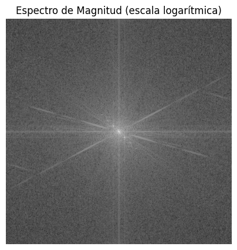
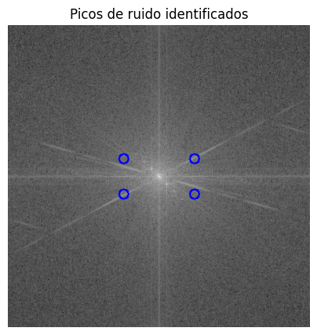
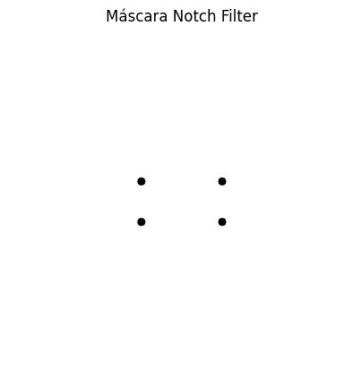
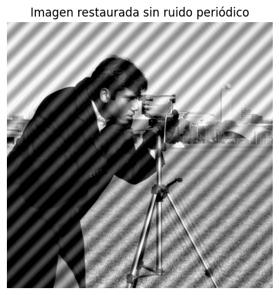
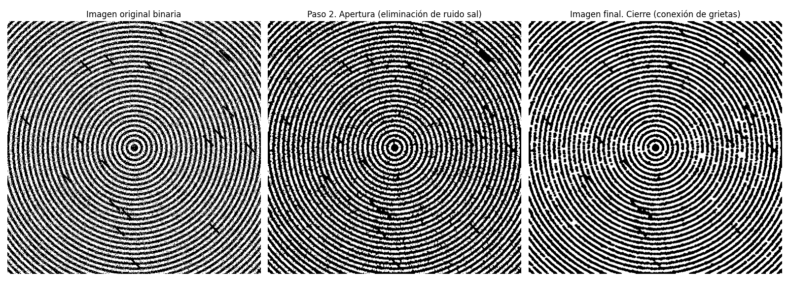
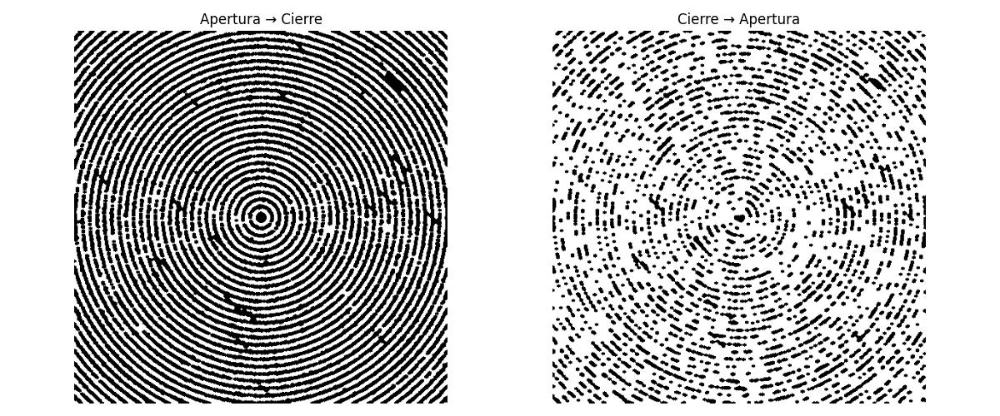
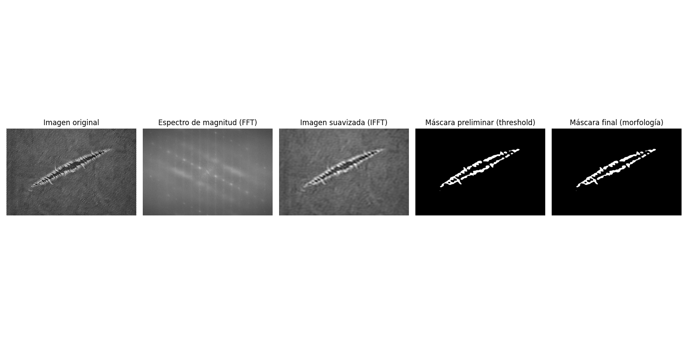
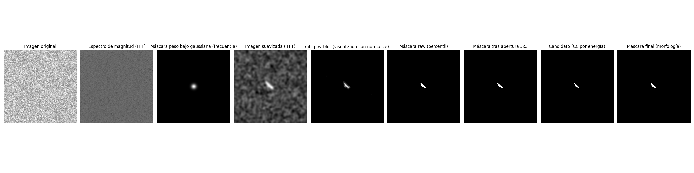

<!-- pandoc --from=markdown+implicit_figures+link_attributes labs/lab2/docs/lab2.md -o labs/lab2/docs/lab2.pdf --pdf-engine=xelatex -V geometry:top=0.67in -V geometry:bottom=0.67in -V geometry:left=0.85in -V geometry:right=0.85in -H header.tex --resource-path=.:images:labs/lab2/images/ -->
# Laboratorio 2

> **Nota:** El pdf se encuentra en [docs/](./docs/lab2.pdf)

## Integrantes

| Name              | Institution ID | GitHub User |
| ----------------- | -------------- | ----------- |
| Josué Say         | 22801          | JosueSay    |
| Carlos Valladares | 221164         | vgcarlol    |

## Enlaces

- [Repositorio](https://github.com/JosueSay/intro-to-computer-vision/tree/main/labs/lab2)

## Comandos

```bash
cd .\labs\lab2\
pip install -r requirements.txt
python ./task1.py
python ./task2.py
python ./task3.py
```

## Task 1

Usted trabaja para una empresa de imágenes satelitales. Una de las cámaras en órbita tiene una interferencia electrónica que genera un ruido sinusoidal (patrón de rayas diagonales) sobre las fotografías de la superficie terrestre. Los filtros espaciales tradicionales (Gaussian Blur) destruyen los detalles geográficos necesarios. Por ello usted ha decidido idear una solución tomando como base fotografías que tiene a mano con el mismo problema previo a implementar la solución real. Con esto en mente, realice:

Para esta parte se espera que entregue:

- Código funcional y visualización correcta del espectro con los picos de ruidos señalados
- Imagen restaurada exitosamente (sin rayas y con detalles nítidos)
- Explique por qué un filtro de promedio (average filter) de 5x5 en el dominio espacial hubiera sido una mala solución para este problema específico.

### Inciso 1

Cargue la imagen `periodic_noise.jpg` en escala de grises.


### Inciso 2

Calcule la Transformada Discreta de Fourier (DFT) y desplace el componente de frecuencia cero al centro.


### Inciso 3

Muestre el Espectro de Magnitud en escala logarítmica.



### Inciso 4

Identifique visualmente los "picos" de energía que no corresponden a la información natural de la imagen (puntos brillantes fuera del centro).

En el espectro se observan picos brillantes simétricos alejados del centro, los cuales corresponden al ruido sinusoidal periódico responsable de las rayas diagonales en la imagen original.



### Inciso 5

Cree una máscara (Notch Filter) que bloquee específicamente esas frecuencias parásitas (haciéndolas cero), pero preserve el resto del espectro, incluyendo el componente DC.



### Inciso 6

Aplique la Transformada Inversa (IDFT) para recuperar la imagen espacial.



### Justificación del método

Un filtro de promedio (average filter) de 5×5 en el dominio espacial hubiera sido una mala solución para este problema porque actúa como un suavizador global. Aunque reduce ruido, también degrada bordes, texturas y detalles geográficos importantes. Dado que el ruido es periódico y se concentra en frecuencias específicas del dominio de Fourier, el uso de un Notch Filter permite eliminar selectivamente dichas frecuencias sin afectar significativamente la información útil de la imagen.

## Task 2

Está desarrollando un sistema biométrico de seguridad. El sensor de huellas dactilares está sucio y produce imágenes binarias con dos tipos de defectos:

1. Pequeños puntos blancos en los valles negros de la huella (ruido sal).
2. Las crestas de la huella presentan pequeñas roturas que impiden el matching (grietas).

### Estrategia

Se utilizó una secuencia de operaciones morfológicas sobre una imagen binaria, con el objetivo de:

1. Eliminar el ruido blanco aislado sin afectar las crestas.
2. Conectar las roturas presentes en las crestas de la huella.

La solución se basa en el uso controlado de **apertura** y **cierre**, aplicadas de forma secuencial.

### Inciso 1. Binarización

La imagen `fingerprint_noisy.png` se cargó en escala de grises y se binarizó utilizando umbralización de Otsu, asegurando una imagen binaria limpia con valores `{0, 255}`.

Posteriormente, se verificó que las crestas de la huella correspondieran al foreground (blanco). En caso contrario, la imagen fue invertida para garantizar que las operaciones morfológicas actuaran correctamente sobre las crestas.

### Inciso 2. Eliminación de ruido sal

- **Operación aplicada:** Apertura morfológica (erosión → dilatación).
- **Elemento estructurante:** Elipse.
- **Tamaño:** 3×3.

**Justificación:**  

El ruido presente corresponde a píxeles blancos pequeños y aislados.  
La apertura elimina estos puntos durante la erosión, y la dilatación posterior restaura el grosor de las crestas sin reintroducir el ruido.  
Esta operación permite limpiar la imagen sin destruir la estructura principal de la huella.

### Inciso 3. Conexión de grietas

- **Operación aplicada:** Cierre morfológico (dilatación → erosión).
- **Elemento estructurante:** Elipse.
- **Tamaño:** 5×5.

**Justificación:**

Las crestas presentan pequeñas discontinuidades.  
La dilatación conecta segmentos cercanos cuya separación es menor que el elemento estructurante, y la erosión posterior corrige el engrosamiento producido, preservando la forma general de las crestas.

### Inciso 4. Resultados

Se muestran tres imágenes:

1. Imagen original binaria.
2. Imagen tras aplicar apertura (eliminación de ruido sal).
3. Imagen final tras aplicar cierre (crestas continuas).

La imagen final presenta **menor ruido y mayor continuidad**, cumpliendo con los requisitos del preprocesamiento para sistemas biométricos.

### ¿El orden de los factores altera el producto?

Sí. Las operaciones morfológicas no son conmutativas, por lo que el orden altera el resultado en términos teóricos.

#### Orden aplicado

- **Apertura → Cierre**

Este orden elimina primero el ruido blanco aislado y luego conecta las grietas reales de las crestas.

#### Orden inverso evaluado

- **Cierre → Apertura**

El resultado sí cambia de forma respecto a **Apertura → Cierre**.

Al aplicar **cierre primero**, la dilatación expande y refuerza muchas estructuras del patrón (incluyendo ruido y fragmentos), y luego la erosión no revierte completamente ese efecto. Cuando después se aplica la **apertura**, la erosión elimina gran parte de los detalles finos y segmentos delgados, provocando que las crestas queden **fragmentadas** y aparezcan **pérdidas importantes de continuidad**, como se observa en la imagen final del orden inverso.

Esto confirma visualmente que **apertura y cierre no son conmutativas** y que el orden altera el resultado.


  


## Task 3

Una fábrica textil necesita detectar defectos automáticamente en telas con textura fuerte. El principal reto es que dicha textura genera respuestas falsas en detectores clásicos de bordes, por lo que se requiere un enfoque que suprima el patrón repetitivo y resalte únicamente las anomalías reales.

Para abordar esto, se implementaron dos pipelines distintos, uno para cada imagen, ambos basados en Fourier y Morfología, pero adaptados al comportamiento particular de cada defecto.

### Trade-offs

La solución es efectiva para defectos cuya escala y comportamiento difieren del patrón periódico de la tela, pero presenta trade-offs importantes. Si la rasgadura o mancha es **muy pequeña o de bajo contraste**, puede atenuarse durante el filtrado en frecuencia o desaparecer tras la apertura morfológica. Asimismo, el método es **sensible al tipo de tela**, cambios en la periodicidad, orientación o regularidad de la textura pueden requerir ajustar el filtro en frecuencia, los percentiles o los criterios de selección. En este sentido, la solución no es completamente genérica, pero el uso de percentiles, energía y logging detallado la hace **adaptable y extensible** a nuevas telas mediante ajuste controlado de parámetros.

### Estrategia general

En ambos casos trabajamos en el dominio de la frecuencia para eliminar la textura y luego regresamos al dominio espacial para segmentar el defecto.
La diferencia está en cómo se define la anomalía y cómo se selecciona el componente final.

### Pipeline 1: Denim – rasgadura visible

En la imagen `denim_tear.png` el defecto es más grande y contrastante, por lo que el pipeline original fue suficiente y no requirió cambios estructurales.

#### 1. Supresión de textura con Fourier

- Se calculó la FFT de la imagen y se observó que la textura del denim se concentra en altas frecuencias.
- Para atenuarla se aplicó un **filtro pasa-bajo circular ideal**, conservando solo las bajas frecuencias.
- Luego, mediante IFFT, se reconstruyó una imagen suavizada donde el patrón del tejido queda fuertemente reducido y la rasgadura permanece visible.

#### 2. Segmentación por umbral fijo

Sobre la imagen suavizada se aplicó un **umbral binario fijo**, suficiente debido al alto contraste del defecto tras la supresión de textura.

#### 3. Refinamiento morfológico

Se utilizó una secuencia de:

1. **Apertura**, para eliminar ruido residual.
2. **Cierre**, para conectar la rasgadura y rellenar huecos.

El resultado es una máscara limpia con la rasgadura claramente aislada.



### Pipeline 2: Textile – defecto sutil en textura fina

En la imagen `textile_defect.jpg` el defecto es mucho más sutil, comparable en escala al grano de la textura.
Aquí el pipeline original no funcionó, por lo que se rediseñó la estrategia de segmentación y selección.

#### 1. Supresión de textura con Fourier

- Se utilizó un **filtro pasa-bajo gaussiano** en el dominio de la frecuencia, más estable que el filtro ideal para este tipo de textura.
- Tras la IFFT, la imagen suavizada mantiene la estructura global pero reduce el grano fino.

#### 2. Diferencia dirigida

En lugar de usar `absdiff`, se calculó:

- **`diff_pos = clip(smoothed − original, 0)`**

Esto permitió:

1. Ignorar cambios donde el defecto es más oscuro.
2. Resaltar únicamente regiones donde la imagen suavizada es **más brillante** que la original.
3. Separar el defecto del ruido de textura, que domina en `absdiff`.

Luego se aplicó un **Gaussian blur** para estabilizar la respuesta.

#### 3. Umbral por percentiles

Debido a la distribución altamente sesgada del residual:

1. Se evaluaron múltiples percentiles altos.
2. Se seleccionó automáticamente aquel cuyo `white_ratio` quedara en un rango razonable.
3. Se evitó explícitamente el caso `threshold = 0`.

Esto produjo una máscara inicial con pocos candidatos coherentes.

#### 4. Apertura ligera

Se aplicó una apertura 3×3 para eliminar puntos aislados sin dañar el defecto principal.

#### 5. Selección por energía (paso decisivo)

En lugar de escoger el componente más grande, o más centrado, se seleccionó el componente conectado con mayor energía, definida como la suma de `diff_pos_blur` dentro del componente.

Este criterio permitió elegir correctamente el defecto real frente a ruido residual.

#### 6. Refinamiento morfológico final

Finalmente se aplicó la misma secuencia de apertura + cierre para obtener una máscara estable y compacta.



### Logging y reproducibilidad

Para facilitar la extensión del método a nuevas imágenes:

1. Se registraron **logs detallados (TSV)** con estadísticas, percentiles, CC y decisiones.
2. Se generó un **CSV por corrida**, con métricas clave del pipeline y del defecto detectado.
3. Cada ejecución queda versionada por timestamp, permitiendo comparar resultados entre imágenes.
