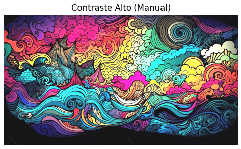
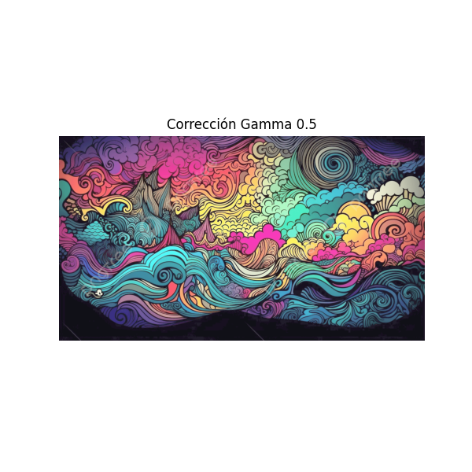
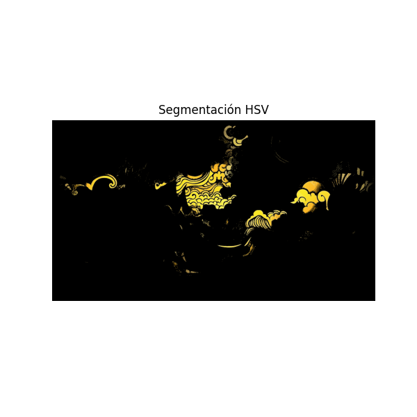

<!-- pandoc --from=markdown+implicit_figures+link_attributes worksheets/ws1/docs/ws1.md -o worksheets/ws1/docs/ws1.pdf --pdf-engine=xelatex -V geometry:top=0.67in -V geometry:bottom=0.67in -V geometry:left=0.85in -V geometry:right=0.85in -H header.tex --resource-path=.:images:worksheets/ws1/images/ -->
# Hoja de Trabajo 1

> **Nota:** El pdf se encuentra en [docs/](./docs/ws1.pdf)

## Integrantes

| Name              | Institution ID | GitHub User |
| ----------------- | -------------- | ----------- |
| Josué Say         | 22801          | JosueSay    |
| Gustavo Cruz      | 22779          | G2309       |
| Carlos Valladares | 221164         | vgcarlol    |

## Enlaces

- [Repositorio](https://github.com/JosueSay/intro-to-computer-vision/tree/main/worksheets/ws1)

## Task 1 - Análisis Teórico

Considere cada uno de los siguientes escenarios y responda según corresponda.

### Pregunta 1

Como director de un proyecto de conducción autónoma, debe dimensionar el hardware para un nuevo vehículo. El sistema utiliza 8 cámaras que capturan video a resolución 4K UHD $(3840 \times 2160)$. Debido a la necesidad de alto rango dinámico (HDR), los sensores operan a 12 bits por píxel (Raw Bayer Pattern) a 60 FPS. Métrica A: enfocada puramente en el flujo vehicular.

1. Calcule el tamaño exacto de una sola imagen (frame) cruda en megabytes (MB).

    Primero calculamos la cantidad total de bits por imagen y luego realizamos las conversiones a Bytes y Megabytes (usando la base binaria $1024^2$, estándar en sistemas operativos).

    $$\text{Píxeles totales} = 3840 \times 2160 = 8,294,400 \text{ px}$$
    $$\text{Bits totales} = 8,294,400 \times 12 \text{ bits} = 99,532,800 \text{ bits}$$

    Convertimos a Bytes ($1 \text{ B} = 8 \text{ bits}$):
    $$\text{Tamaño en Bytes} = \frac{99,532,800}{8} = 12,441,600 \text{ Bytes}$$

    Convertimos a Megabytes ($1 \text{ MB} = 1024 \times 1024 \text{ B}$):
    $$\text{Tamaño en MB} = \frac{12,441,600}{1,048,576} \approx \mathbf{11.86 \text{ MB}}$$

2. Calcule el ancho de banda necesario (en Gbps) para transmitir el flujo de las 8 cámaras al procesador central sin compresión.

    Calculamos el flujo de datos total por segundo para las 8 cámaras sin compresión.

    $$\text{Bits por segundo} = (\text{bits por frame}) \times (\text{cámaras}) \times (\text{FPS})$$
    $$\text{bps} = 99,532,800 \times 8 \times 60 = 47,775,744,000 \text{ bits/s}$$

    Convertimos a Gigabits por segundo (usando base decimal $10^9$ para telecomunicaciones):
    $$\text{Bandwidth} = \frac{47,775,744,000}{10^9} \approx \mathbf{47.78 \text{ Gbps}}$$

3. Si su procesador tiene una memoria RAM reservada de 16 GB exclusivamente para el buffer de video, ¿cuántos segundos de historia puede almacenar antes de empezar a sobrescribir datos?

    Para determinar los segundos de historia, primero necesitamos la tasa de llenado de la memoria (Throughput) en las mismas unidades que la RAM (Gigabytes binarios o GiB).

    - Tasa de entrada: $12,441,600 \text{ Bytes/frame} \times 8 \times 60 = 5,971,968,000 \text{ Bytes/s}$
    - Tasa en GB: $5,971,968,000 / 1024^3 \approx 5.56 \text{ GB/s}$

    $$\text{Tiempo} = \frac{\text{Memoria Total}}{\text{Tasa de Entrada}} = \frac{16 \text{ GB}}{5.56 \text{ GB/s}} \approx \mathbf{2.87 \text{ segundos}}$$

4. Basado en su resultado, ¿es viable enviar estos datos “crudos” a la nube en tiempo real usando 5G? Justifique.

    **Respuesta: No es viable.**

    **Justificación:**
    El cálculo del inciso (b) arroja un requerimiento de **~47.8 Gbps** de subida (uplink). Aunque el marketing de 5G promete velocidades pico teóricas altas (10-20 Gbps en descarga), la velocidad de **subida** real en condiciones óptimas rara vez supera 1 Gbps (incluso con mmWave). El ancho de banda requerido excede la capacidad actual de la infraestructura por un factor de casi 50x. Es arquitectónicamente obligatorio procesar en el borde (Edge Computing) o aplicar compresión agresiva antes de transmitir.

### Pregunta 2

Considere un píxel con valor de intensidad $I_{in} = 50$ en una imagen estándar de 8 bits $(0{-}255)$. Se aplican dos procesos de mejora secuenciales en el siguiente orden:

1. Corrección gamma con $\gamma = 0.5$ (para expandir sombras).
2. Ajuste lineal con ganancia $\alpha = 1.2$ y brillo $\beta = -10$ (para contrastar).

Realice los cálculos en el dominio de flotantes normalizados $[0,1]$, como dicta la buena práctica, y convierta a entero de 8 bits solo al final.

1. Calcule el valor final del píxel $I_{out}$.

    1. **Normalización [0, 1]:**
      $$I_{norm} = \frac{50}{255} \approx 0.196078$$

    2. **Corrección Gamma ($Y=0.5$):**
      $$V_{gamma} = (I_{norm})^{0.5} = \sqrt{0.196078} \approx 0.442807$$

    3. **Ajuste Lineal:**
      Primero normalizamos $\beta$ al dominio flotante: $\beta_{norm} = -10/255 \approx -0.039216$.
      $$I_{lin} = (\alpha \times V_{gamma}) + \beta_{norm}$$
      $$I_{lin} = (1.2 \times 0.442807) - 0.039216$$
      $$I_{lin} = 0.531368 - 0.039216 = 0.492152$$

    4. **Conversión a uint8:**
      $$I_{out} = I_{lin} \times 255 = 0.492152 \times 255 \approx 125.49$$

      Redondeando: **$I_{out} = 125$**

2. ¿Hubo saturación (clipping) en el proceso?

    **No.** El valor resultante en el dominio flotante ($0.492$) se mantuvo estrictamente dentro del rango $[0, 1]$, por lo que no fue necesario recortar valores que excedieran los límites.

3. Si hubiéramos realizado las operaciones usando `uint8` directamente sin convertir a `float` (truncando decimales en cada paso intermedio), ¿cuál habría sido el error numérico resultante?

    Si simulamos el proceso con enteros (truncando decimales):

    1. **Gamma (aprox en enteros):** $255 \times (50/255)^{0.5} = 112.9 \rightarrow \text{trunc}(112)$.
    2. **Lineal:** $(1.2 \times 112) - 10 = 134.4 - 10 = 124.4 \rightarrow \text{trunc}(124)$.

    - Resultado Flotante: **125.5**
    - Resultado Entero: **124**

    **Error:** Existe una desviación de aproximadamente **1.5 niveles de intensidad**. En procesamiento de video o gradientes suaves, este error acumulado causaría *banding* visible.

### Pregunta 3

Usted está programando un robot clasificador de pelotas. Tiene dos objetos: una pelota roja brillante bajo el sol $R_{rgb} = (255, 0, 0)$ y la misma pelota roja en una sombra profunda $S_{rgb} = (50, 0, 0)$.

1. Calcule la distancia entre estos dos colores en el espacio RGB.

    $$d = \sqrt{(R_1-R_2)^2 + (G_1-G_2)^2 + (B_1-B_2)^2}$$
    $$d = \sqrt{(255-50)^2 + 0 + 0} = \sqrt{205^2} = \mathbf{205}$$

    *(Una distancia inmensa considerando que el máximo posible es $\approx 441$).*

2. Convierta ambos colores al espacio HSV (asuma rangos normalizados $H \in [0,1]$, $S \in [0,1]$, $V \in [0,1]$ para simplificar, sabiendo que el Hue del rojo es $0$).

    **Para $R_{rgb} (255, 0, 0)$:**

    - $R'=1, G'=0, B'=0$. Max=1, Min=0.
    - Hue ($H$): 0 (Rojo puro).
    - Sat ($S$): $(1-0)/1 = 1$.
    - Val ($V$): 1.
    - **$HSV_{sol} = (0, 1, 1)$**

    **Para $S_{rgb} (50, 0, 0)$:**

    - $R'=50/255 \approx 0.196$. Max=0.196, Min=0.
    - Hue ($H$): 0.
    - Sat ($S$): $(0.196-0)/0.196 = 1$.
    - Val ($V$): 0.196.
    - **$HSV_{sombra} = (0, 1, 0.196)$**

3. Calcule la diferencia absoluta canal por canal en HSV.

    - $\Delta H = |0 - 0| = \mathbf{0}$
    - $\Delta S = |1 - 1| = \mathbf{0}$
    - $\Delta V = |1 - 0.196| = \mathbf{0.804}$

4. Argumente matemáticamente por qué un algoritmo de agrupación (clustering) simple fallaría en RGB pero funcionaría en HSV para determinar que ambos píxeles pertenecen al mismo objeto “pelota roja”.

    Un algoritmo de clustering simple (como K-Means o umbralización esférica) en **RGB** fallaría porque la distancia euclidiana entre los vectores es de **205**. El algoritmo interpretaría esto como dos objetos de clases totalmente distintas (ej. "Rojo brillante" vs "Negro/Gris"), ya que la magnitud de la intensidad domina el cálculo de la distancia.

    En cambio, en **HSV**, los canales que definen la "cromaticidad" del objeto ($H$ y $S$) tienen una distancia de **0**. La única variación ocurre en $V$ (brillo). Al usar HSV, podemos configurar el algoritmo para que agrupe basándose estrictamente en $H$ y $S$, ignorando la varianza en $V$. Esto hace al sistema **invariante a la iluminación**, permitiendo identificar correctamente que ambos píxeles pertenecen a la misma "pelota roja".

## Task 2 – Práctica

Su objetivo es implementar un pipeline de pre-procesamiento manual, manipulando tensores y gestionando tipos de datos (`uint8` vs `float32`) sin utilizar funciones de “caja negra” para la matemática. Puede utilizar el esqueleto de código `lab_semana1.py` que se adjuntó en el portal. Se permite el uso de `numpy`, `opencv-python` (solo para I/O y conversiones de espacio de color) y `matplotlib`.

### Ejercicio 1: Contraste y Brillo Vectorizado

Implemente la función `manual_contrast_brightness(image, alpha, beta)`. Para ello, debe convertir la imagen a `float32`, normalizar, aplicar la fórmula lineal
$g(x) = \alpha f(x) + \beta$,
hacer *clipping* para asegurar el rango $[0, 1]$ y regresar a `uint8`.

Note que no puede usar `cv2.convertScaleAbs`. Debe hacerlo con pura manipulación de matrices NumPy.

#### Respuestas

- Se convirtió la imagen de `uint8` a `float32` y se normalizó al rango `[0,1]` usando `image.astype(np.float32) / 255`.
- Se aplicó la transformación lineal vectorizada $g(x) = \alpha f(x) + \beta$, ajustando el brillo a escala normalizada ($\beta/255$).
- Se aseguró el rango válido mediante `np.clip(out, 0, 1)`.
- Se des-normalizó la imagen y se convirtió nuevamente a `uint8`.
  - Usando `(out * 255).round().astype(np.uint8)`.
- La implementación se realizó únicamente con operaciones vectorizadas de NumPy, sin usar funciones de caja negra.

### Ejercicio 2: Corrección Gamma Manual

Implemente la función `manual_gamma_correction(image, gamma)`. Para ello:

- Implemente la ecuación
  $V_{\text{out}} = V_{\text{in}}^{\gamma}$

- Recuerde que la operación de potencia es costosa. Aunque en producción usaríamos una LUT (*Look-Up Table*), aquí se requiere vectorizar la operación de potencia sobre la matriz flotante.

#### Respuestas

- Se convirtió la imagen a `float32` y se normalizó al rango `[0,1]`.
- Se aplicó la corrección gamma de forma vectorizada utilizando la ecuación $V_{\text{out}} = V_{\text{in}}^{\gamma}$.
- Se aplicó *clipping* para mantener los valores dentro del rango válido.
- Se des-normalizó la imagen y se convirtió de regreso a `uint8`.

### Ejercicio 3: Segmentación Cromática

Implemente la función `hsv_segmentation(image)`. Para ello:

- Cargue una imagen de prueba (algo colorido).
- Conviértala a HSV.
- Defina manualmente los rangos `(lower_bound, upper_bound)` para aislar un color específico (ej. el amarillo de un banano o el rojo de una manzana).
- Genere una máscara binaria y úsela para mostrar solo el objeto segmentado sobre un fondo negro.

#### Respuestas

- Se cargó una imagen de prueba y se convirtió del espacio de color BGR a HSV.
- Se definieron manualmente rangos HSV para aislar un color específico (amarillo).
- Se generó una máscara binaria mediante `cv2.inRange`.
- Se aplicó la máscara a la imagen original para mostrar únicamente el objeto segmentado sobre un fondo negro.

## Task 3 – Preguntas Post-Práctica

Responda brevemente (máximo 3 líneas por respuesta):

1. En la diapositiva 15 se mencionó que *“Iterar píxel a píxel en Python es un Pecado Capital”*. Explique, en términos de gestión de memoria y CPU, por qué una operación vectorizada en NumPy es órdenes de magnitud más rápida que un *for loop*.

    - **R:** NumPy ejecuta operaciones en C sobre bloques contiguos de memoria, procesando miles de píxeles simultáneamente en lugar de uno por uno. Y esto ayuda a evitar el overhead del intérprete de Python en cada iteración y aprovecha mejor el caché del CPU, siendo miles de veces más rápido que un for loop normal

2. Al visualizar imágenes con `matplotlib`, ¿qué sucede si olvida que OpenCV carga las imágenes en formato BGR? ¿Cómo se ve visualmente el error?

    - **R:** Pues los formatos indican el orden de los canales de color, para RGB es rojo, verde, azul y para BGR es azul, verde, rojo. Por lo que al cargar la imágen con formato BGR vamos a ver que los canales rojo y azul estan intercambiados.
